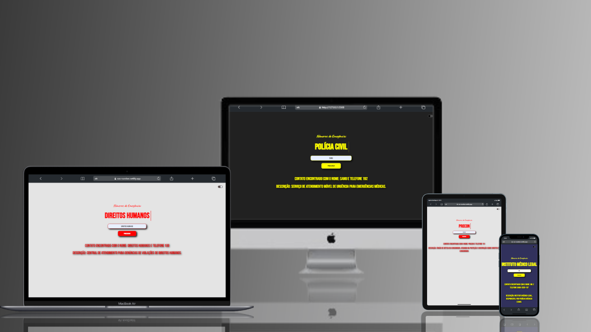

<h1  align="center" height="30" width="80" color="yellow" >S.O.S - NUMBER</h1>

O projeto "SOS Number" é uma aplicação web simples que oferece números de telefone temporários para receber SMS, protegendo a privacidade dos usuários. Vamos detalhar as funções dos principais componentes: HTML, CSS e JavaScript.

### HTML:
- *Estruturação do Conteúdo:* O HTML fornece a estrutura básica da página, definindo elementos como títulos, parágrafos, botões e áreas onde os números de telefone temporários são exibidos. Ele organiza o layout da página, facilitando a navegação dos usuários.
- *Elementos Interativos:* O HTML também inclui formulários e botões que permitem aos usuários interagir com a página, como selecionar ou copiar números temporários.

### CSS:
- *Estilização Visual:* O CSS é responsável por definir a aparência da página, como cores, fontes, espaçamento e layout. Ele garante que a página tenha um design limpo e atraente, melhorando a experiência do usuário.
- *Responsividade:* O CSS também pode incluir regras para tornar a página responsiva, adaptando-se a diferentes tamanhos de tela e dispositivos, garantindo que o site seja acessível em dispositivos móveis e desktops.

### JavaScript:
- *Funcionalidade Dinâmica:* O JavaScript desempenha um papel crucial na aplicação, adicionando interatividade e funcionalidade dinâmica à página. Ele é usado para:
  - *Carregar e Atualizar Números:* Carregar números de telefone temporários de uma fonte externa e atualizar a lista de números disponíveis sem precisar recarregar a página.
  - *Manipulação do DOM:* O JavaScript manipula o Document Object Model (DOM) para exibir ou ocultar informações na página, dependendo da interação do usuário.
  - *Copiar Número para Área de Transferência:* Implementar a função de copiar um número temporário para a área de transferência quando o usuário clica em um botão, facilitando o uso do número em outras plataformas.
  - *Validação e Feedback:* Fornecer feedback ao usuário, como notificações ou mensagens de erro, se uma ação for bem-sucedida ou falhar, aprimorando a usabilidade.

Em resumo, o projeto combina HTML para a estrutura, CSS para a estilização e JavaScript para a funcionalidade, resultando em uma ferramenta prática e eficiente para a geração de números temporários de telefone.

<video src="https://github.com/user-attachments/assets/64f2ba1f-ed0c-4957-bc5e-2c77319c905c" type="video/mp4">
</video>

<video src="https://github.com/user-attachments/assets/08701ac6-af66-458a-89a5-f3218d68fa4d">

